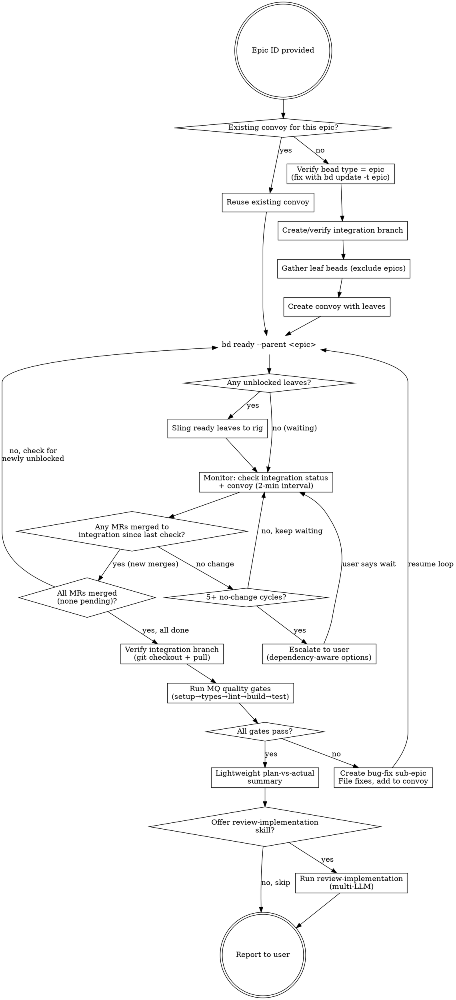

# Epic Delivery

Orchestrate full delivery of a beads epic through polecats, refinery, and integration branches. The crew member acts as dispatcher and monitor; polecats do the implementation work.

**Coexists with `implementing-beads-epic`** (that skill = crew does work locally via subagents; this skill = polecats do work via Gas Town infrastructure).

## When to Use

- Epic exists with leaf tasks ready for implementation
- Want polecat-delegated delivery (not local crew execution)
- Need integration branch isolation before landing to main
- Want automated wave dispatch based on dependency unblocking

## When NOT to Use

- Single task (just `gt sling <id> <rig>` directly)
- No beads epic exists (create one first with `design-to-beads`)
- Want crew to implement directly (use `implementing-beads-epic`)

## Input

**Required:** Epic ID (e.g., `gt-abc`)

The target rig is auto-detected from your current workspace.

---

## Process Overview



---

## Phase 1: Setup

### 1a. Check for Existing Convoy

If resuming a previous delivery attempt (e.g., after a crash or manual restart), a convoy may already exist:

```bash
# Check for existing convoys tracking this epic's children
gt convoy list --json
```

If a convoy already exists for this epic, **reuse it** — skip to Phase 2. The convoy is the persistent state machine; creating a duplicate would split tracking.

### 1b. Verify Epic Type

`gt mq integration create` requires the bead to be typed as `epic`. Beads may be typed as `task` even if they have children. Check and fix before proceeding:

```bash
# Check the bead's type
bd show <epic-id> --json | python3 -c "import json,sys; d=json.load(sys.stdin)[0]; print(d['issue_type'])"

# If type is NOT 'epic', fix it:
bd update <epic-id> -t epic
```

### 1c. Create or Verify Integration Branch

```bash
# Check if integration branch already exists
gt mq integration status <epic-id>

# If none exists, create one
gt mq integration create <epic-id>
```

The branch name follows the rig's `merge_queue.integration_branch_template` setting (default: `integration/{epic}`). Record the branch name for use in Phase 4.

### 1d. Gather Leaf Beads

Collect all implementable children — exclude epics and sub-epics.

```bash
# List all children of the epic (recursive across all nesting depths)
bd list --parent <epic-id> --all --limit 0 --json
```

**Type-based filter:** Include `task`, `bug`, `feature`, `chore`. Exclude `epic`. The `--parent` flag is recursive, so this works regardless of nesting depth — a task three levels deep under nested sub-epics will appear in the flat result set.

**Cross-sub-epic dependencies are bead-to-bead, not epic-scoped.** If `gt-b2` depends on `gt-a1` (from a different sub-epic), `bd ready` correctly resolves this because dependencies reference bead IDs directly, not their parent epics.

### 1e. Create Convoy

```bash
# Create convoy with all leaf bead IDs (NOT epic/sub-epic IDs)
gt convoy create "<epic-title> delivery" <leaf-id-1> <leaf-id-2> ... <leaf-id-n>
```

Record the convoy ID (e.g., `hq-cv-xyz`) — this is your persistent state tracker for the rest of the process.

**Only add leaf beads to the convoy.** Never add epic or sub-epic beads. The convoy tracks implementable work items; epics are organizational containers.

**Exclude already-closed leaves.** Some leaves may already be closed from prior work. Filter these out — adding closed beads to the convoy inflates the total count and confuses progress tracking.

---

## Phase 2: Dispatch

### 2a. Query Polecat Capacity

```bash
# Get max polecats for the rig
gt rig config show <rig>
# Look for max_polecats value (default: 10)
```

**Note:** The rig enforces `max_polecats` at the infrastructure level. This limit covers ALL polecats in the rig — including ones you slung AND ones the refinery spawns for conflict resolution. Respect this limit — don't sling more than it allows.

### 2b. Ensure Daemon Is Running

The daemon manages polecat lifecycle and drives the refinery. Without it, polecats won't be monitored and MRs won't be processed.

```bash
gt daemon status
# If not running:
gt daemon start
```

### 2c. Find Ready Work

```bash
# Find unblocked leaf tasks under the epic
bd ready --parent <epic-id> --json
```

`bd ready` already excludes hooked, in_progress, blocked, and deferred beads. Only truly claimable work appears.

**Filter results carefully:**
- Exclude epics/sub-epics by type — only sling task, bug, feature, chore
- Verify each result's ID is actually under the target epic (e.g., starts with the expected prefix) — `bd ready --parent` may return broader results than expected
- For Wave 2+: verify each task's dependencies have MRs merged to the integration branch (check `gt mq integration status`), not just that the dependency beads are closed

### 2d. Sling Ready Leaves

**Batch sling is currently broken.** Sling each leaf individually with `--no-convoy` (the convoy was already created in Phase 1):

```bash
# Sling each leaf one at a time
gt sling <leaf-1> <rig> --no-convoy
gt sling <leaf-2> <rig> --no-convoy
gt sling <leaf-3> <rig> --no-convoy
# ... repeat for each ready leaf
```

`gt sling` auto-targets the integration branch when the parent epic has one. Each leaf gets its own polecat. Respect `max_polecats` — don't sling more than the rig allows.

**Report to user:** "Slung N tasks to <rig>: <list of task titles>"

---

## Phase 3: Monitor Loop

**Hybrid pattern:** 15 check cycles at 2-minute intervals, then handoff to fresh session.

### Critical: MR Merge Is the Readiness Signal

**Do NOT use bead closure as the signal to dispatch dependent tasks.** Polecats close their beads when they submit via `gt done`, but the code hasn't landed on the integration branch yet. The refinery merges MRs to the integration branch — only after that merge is the code available to dependents.

**Source of truth for "work has landed":** `gt mq integration status <epic-id>` → count of merged MRs and commits ahead of main.

**Commits ahead ≠ MRs merged.** The commit count is always higher because: polecats may make multiple commits per task, the refinery creates merge commits, and the refinery may add its own fix commits. Track the **merged MR count**, not the commit count.

Sequence of events for each task:
1. Polecat completes work → `gt done` → MR bead created, task bead may close
2. Refinery picks up MR → reviews → merges to integration branch
3. **Only now** is it safe to sling tasks that depend on this work

### The Check Cycle

Each cycle:

1. **Check integration branch status (primary signal):**
   ```bash
   gt mq integration status <epic-id>
   ```
   Track the count of merged MRs and pending MRs. New merges since last check = new work landed.

2. **Check convoy status (secondary, for overall progress):**
   ```bash
   gt convoy status <convoy-id>
   ```

3. **If new MRs merged since last check:**
   - Report: "Landed on integration branch: <task-title> (N/total MRs merged)"
   - Check completion (see below)
   - If not all done: run `bd ready --parent <epic-id>` to find newly unblocked work
   - Cross-check: for each newly ready task, verify its dependencies' MRs have merged (check integration status merged list)
   - If ready AND dependencies landed, sling it (Phase 2c)
   - Reset no-change counter to 0

4. **If no new MRs merged:**
   - Increment no-change counter
   - If counter exceeds patience threshold (5 consecutive no-change cycles = ~10 min): escalate to user

5. **Check for refinery re-assignments** (see Failure Handling below)

### Completion Check

**"All done" means:** every leaf task's MR has been merged to the integration branch. Do NOT rely on bead status alone.

```bash
# Primary: check integration branch for all expected MRs merged
gt mq integration status <epic-id>

# Secondary: check for any leaves still open/in_progress (exclude epics by type)
bd list --parent <epic-id> --status open --limit 0 --json
bd list --parent <epic-id> --status in_progress --limit 0 --json
```

**Both conditions must be true:** integration status shows all MRs merged (no pending), AND no open/in_progress leaf tasks remain. If pending MRs still exist, wait — the refinery hasn't finished processing.

If deferred tasks exist, note them — they'll appear in the completion report. Use `gt convoy close <convoy-id> --force` at the end since the convoy won't auto-close with deferred items.

### Timing

```
Cycle 1  → check → [sleep 2 min]
Cycle 2  → check → [sleep 2 min]
...
Cycle 15 → check → handoff (if work still in flight)
```

**Sleep implementation:**
```bash
sleep 120  # 2 minutes between checks
```

### Handoff During Monitoring

When cycling after 10 checks:

```bash
gt handoff -s "Epic delivery: <epic-id> monitoring" -m "
IMPORTANT: Run Skill('epic-delivery') FIRST before doing anything else.

Epic: <epic-id>
Convoy: <convoy-id>
Integration branch: <branch-name>
Progress: N/total MRs merged to integration branch, M deferred, K in-flight
Pending MRs: <list of pending MR bead IDs>
Open leaves: <list of open leaf bead IDs>
Active polecats: <count>
Refinery re-assignments: <any noted>
Last slung: <timestamp>
No-change counter: <value>
Phase: MONITORING
Next action: reload skill, then resume check cycle
"
```

### Resume After Handoff

**MANDATORY FIRST STEP: Reload this skill.** Run `Skill("epic-delivery")` before doing ANYTHING else. The skill defines the full process including phases you may not remember from the handoff message. Skipping this step causes phases to be missed (e.g., the deep review offer in Phase 4e, the landing boundary in Phase 4f).

Then detect phase from state:

1. Read convoy status: `gt convoy status <convoy-id>` (convoy ID is in the handoff mail)
2. Check epic progress: `bd list --parent <epic-id> --tree`
3. If all leaves closed/deferred → go to Phase 4 (Validation)
4. If leaves still open → resume Phase 3 (Monitor Loop)
5. Run `bd ready --parent <epic-id>` — sling anything newly unblocked

**The convoy IS the persistent state machine.** No separate state file needed.

---

## Failure Handling

### Refinery Re-assigns Work (Normal)

The refinery may encounter a merge conflict and spawn a fresh polecat to re-implement. This is normal.

**How to detect:** Check `gt convoy status <convoy-id>` — the convoy status shows tracked issues and their current state. Also check merge request beads:

```bash
# Look for MR beads related to the task
bd list --parent <epic-id> --type merge-request --json
```

A re-assigned task will have an MR bead with conflict status, and a new polecat session will appear. The original task bead remains `in_progress` — it will be closed when the fresh polecat succeeds.

**Action:** Inform the user and wait.
> "Refinery detected conflict on <task-title>. Re-assigned to fresh polecat. Waiting for re-implementation."

The refinery-spawned polecat counts against the rig's `max_polecats` limit. If the rig is at capacity, `gt sling` will wait for a slot. You do not need to manage this — the infrastructure handles it.

### Orphaned Polecat Work (Code Exists, No MR)

A polecat may exit without calling `gt done` — code is pushed to a branch but no MR was submitted. The deacon may respawn the task to a fresh polecat, wasting the completed work.

**How to detect:** Polecat is gone (`gt polecat list <rig>` shows no polecat for the task), but the polecat branch exists with commits:

```bash
# Check if branch exists with work
git branch -r | grep "<task-id>"
git log origin/polecat/<name>/<task-id>@<session> --oneline -5

# Check diff against integration branch
git diff origin/<integration-branch>...origin/polecat/<name>/<task-id>@<session> --stat
```

**Recovery:** If the code looks complete, manually submit the MR:

```bash
gt mq submit --branch polecat/<name>/<task-id>@<session> --issue <task-id> --epic <epic-id> --no-cleanup
```

This puts the branch in the merge queue for the refinery to process. The `--no-cleanup` flag preserves the branch.

### Stale Beads After MR Merge

MRs may merge to the integration branch but the task bead remains open — often because molecule wisps block closure. This prevents dependent tasks from becoming ready.

**How to detect:** `gt mq integration status` shows merged MR, but `bd show <task-id>` shows open/in_progress.

**Recovery:** Force-close the bead:

```bash
bd close <task-id> --force
```

The `--force` flag overrides open molecule wisp blockers. Only use this when you've confirmed the MR has merged.

### Truly Stuck (Escalate)

**Detection:** No progress on a task for an extended period. Signs:
- Polecat session is gone (crashed/killed) but bead still open
- Bead in `in_progress` but no active polecat working on it
- MR submitted but refinery not processing it

**Action:** Escalate immediately. Do NOT re-sling or kill polecats. Check dependencies before presenting options:

```bash
# Check what depends on the stuck task (direction=up shows dependents)
bd dep tree <bead-id> --direction=up
```

**If the stuck task HAS dependents** (other tasks are blocked by it):

```
AskUserQuestion:
  "Task <task-title> (<bead-id>) appears stuck:
   - <description of symptoms>
   - WARNING: <N> downstream tasks depend on this. Skipping is not an option.
   Should I:
   1. Wait longer (give it more time)
   2. Re-sling to a fresh polecat
   3. I'll fix this manually — pause the delivery until I say to continue
   4. Abort the delivery entirely"
```

**If the stuck task has NO dependents** (nothing downstream depends on it):

```
AskUserQuestion:
  "Task <task-title> (<bead-id>) appears stuck:
   - <description of symptoms>
   - No downstream dependencies — safe to skip.
   Should I:
   1. Wait longer (give it more time)
   2. Re-sling to a fresh polecat
   3. Skip this task (defer it, continue with others)
   4. I'll fix this manually — pause until I say to continue"
```

**If user says "skip" (only offered for tasks with no dependents):**

```bash
bd update <bead-id> --status deferred
```

**If user says "I'll fix manually":** Pause the monitor loop. Wait for the user to say "continue" or "resume". Then re-enter the check cycle — the user's manual fix should have closed or unblocked the task.

### Never Do These

- **Never kill a polecat** — the witness manages polecat lifecycle
- **Never re-sling a hooked/in_progress bead** — `bd ready` already excludes these
- **Never retry without user approval** when something has genuinely failed

---

## Phase 4: Validation

Triggered when all convoy leaves are closed or deferred.

### 4a. Verify Integration Branch

```bash
gt mq integration status <epic-id>
```

Confirm all expected work has landed. If any MRs are still pending in the refinery queue, wait for them before proceeding.

### 4b. Run Quality Gates

**Always check out and pull the integration branch before running gates:**

```bash
git checkout <integration-branch>
git pull
```

Read the rig's MQ settings to determine which gates are configured:

```bash
gt rig settings show <rig>
```

Run each configured gate **in order**. Skip any that are empty/unconfigured:

| Order | Setting | Run if |
|-------|---------|--------|
| 1 | `setup_command` | Non-empty |
| 2 | `typecheck_command` | Non-empty |
| 3 | `lint_command` | Non-empty |
| 4 | `build_command` | Non-empty |
| 5 | `test_command` | Non-empty |

**Fail fast:** If any gate fails, stop and proceed to 4c.

### 4c. Handle Quality Gate Failures

If any gate fails:

1. **Report failures to user** with full output
2. **Recommend** creating a bug-fix sub-epic:

```
AskUserQuestion:
  "Quality gate '<gate-name>' failed:
   <error summary>

   Recommended: Create bug-fix sub-epic with individual fix tasks, add to convoy, and resume delivery.

   Options:
   1. Create bug-fix sub-epic (Recommended)
   2. Let me fix manually first
   3. Skip and report as-is"
```

3. If user approves bug-fix sub-epic:

```bash
# Create sub-epic under the main epic
bd create "<epic-title>: bug fixes" -t epic --parent <epic-id>

# File individual fix beads (one per issue identified)
bd create "Fix: <description of issue 1>" -t bug --parent <bugfix-epic-id>
bd create "Fix: <description of issue 2>" -t bug --parent <bugfix-epic-id>

# Add new leaves to existing convoy
gt convoy add <convoy-id> <fix-1-id> <fix-2-id> ...
```

4. **Resume from Phase 2.** The fix beads target the same integration branch. After fix polecats complete and the refinery merges their work, **re-run ALL quality gates from scratch** (not just the failed one) — earlier gates may have been affected by the fixes.

**Remember to `git checkout <integration-branch> && git pull`** before re-running gates to pick up the new commits from fix polecats.

### 4d. Lightweight Plan-vs-Actual Summary

When all quality gates pass:

1. **Find the plan document.** Check for a plan file first — this is the authoritative source of requirements:
   ```bash
   # Check for plan.md in the plans folder (common locations)
   ls plans/ .beads/plans/ docs/plans/ 2>/dev/null
   # Look for files matching the epic name/ID
   ```
   If a plan.md exists, read it and use it as the primary reference for acceptance criteria.

   **If no plan file exists**, fall back to the beads themselves:
   ```bash
   bd show <epic-id>
   # Read each leaf task's acceptance criteria
   bd list --parent <epic-id> --all --limit 0 --json
   ```

2. **Read the integration branch diff** vs main:
   ```bash
   git diff main...<integration-branch> --stat
   ```

3. **Produce a summary mapping** each acceptance criterion to the task that delivered it:

```
Epic <epic-id> delivery complete.

Convoy: <convoy-id> — N leaves closed, M deferred (skipped)
Integration branch: <branch-name> — all quality gates pass

## Plan vs Actual
- [criteria 1]: Met (implemented in <task-id>)
- [criteria 2]: Met (implemented in <task-id>)
- [criteria 3]: Partial — <explanation of gap>

## Skipped Tasks (if any)
- <bead-id>: <title> — deferred (reason: <why it was skipped>)

## Notes
- <any important observations, e.g., refinery re-assignments, bug-fix rounds>
```

### 4e. Offer Deep Review

After the lightweight summary, ask the user if they want a comprehensive multi-LLM review:

```
AskUserQuestion:
  "Lightweight plan-vs-actual summary is above. Would you like a deeper review
   using the review-implementation skill? This runs a multi-LLM analysis
   (Opus, GPT, Gemini) comparing the implementation against the original spec."

   Options:
   1. Run review-implementation (thorough multi-LLM review)
   2. Skip — the summary is sufficient
```

If user selects option 1:

```
Skill(
  skill="review-implementation",
  args="<epic-id>"
)
```

### 4f. Report and Next Steps

```
## Next Steps
The integration branch is validated. Typical next steps:
1. QA run (separate skill/process — test the integration branch before landing)
2. Land to main: gt mq integration land <epic-id> (after QA passes)
```

**This skill ends here.** Landing to main happens after QA, not before. The integration branch is the staging area; landing is a separate deliberate act.

---

## Quick Reference

| Phase | Key Command | What Happens |
|-------|-------------|--------------|
| Setup | `bd show <epic> --json` | Verify epic type before branch creation |
| Setup | `gt mq integration create <epic>` | Creates integration branch |
| Setup | `gt convoy create "<name>" <ids...>` | Creates convoy tracker |
| Dispatch | `bd ready --parent <epic>` | Finds unblocked leaves |
| Dispatch | `gt sling <id> <rig> --no-convoy` | Sling one leaf at a time (batch broken) |
| Monitor | `gt mq integration status <epic>` | **Primary signal:** checks merged MRs |
| Monitor | `gt convoy status <convoy-id>` | Secondary: overall progress |
| Failure | `bd list --type merge-request --parent <epic>` | Check for conflict re-assignments |
| Failure | `gt mq submit --branch <branch> --issue <id> --epic <epic> --no-cleanup` | Rescue orphaned polecat branch |
| Failure | `bd close <id> --force` | Force-close stale bead (after MR merge confirmed) |
| Skip | `bd update <id> --status deferred` | Skip a stuck task |
| Validate | `gt mq integration status <epic>` | Verifies branch state |
| Validate | `gt rig settings show <rig>` | Gets quality gate commands |
| Review | `Skill("review-implementation", "<epic>")` | Multi-LLM deep review |
| Complete | `gt mq integration land <epic>` | Merges integration to main |
| Close | `gt convoy close <convoy-id> --force` | Close convoy (if deferred tasks exist) |

## Common Mistakes

| Mistake | Correction |
|---------|------------|
| Slinging dependents on bead closure | **Most critical mistake.** Bead closure ≠ code landed. Wait for MR merge to integration branch (`gt mq integration status`) |
| Not checking epic type before branch creation | `gt mq integration create` requires type=epic. Check with `bd show --json`, fix with `bd update -t epic` |
| Slinging epics/sub-epics | Filter by type — only sling task, bug, feature, chore |
| Re-slinging hooked beads | `bd ready` already excludes these — trust it |
| Killing polecats when slow | Never kill polecats — escalate to user instead |
| Polling too aggressively | 2-minute intervals minimum between checks |
| No convoy created | Always create convoy — it's your state machine |
| Duplicate convoy on resume | Check for existing convoy before creating a new one |
| Forgetting max_polecats | Query `gt rig config show <rig>` and respect the limit |
| Skipping quality gates | Run ALL configured gates before declaring success |
| Running gates on stale code | Always `git checkout <branch> && git pull` before gates |
| Only re-running failed gate | After bug fixes, re-run ALL gates from scratch |
| Bug fixes on new branch | Bug fixes go to same integration branch via same convoy |
| Skipping task with dependents | NEVER skip tasks that have downstream dependents — offer re-sling or manual fix instead |
| Skipped task blocks convoy close | Use `bd update --status deferred` + `gt convoy close --force` (only for no-dependent tasks) |
| Not comparing plan vs actual | Always do lightweight sense check before reporting |
| Not loading skill on resume | After handoff, first action must be `Skill("epic-delivery")` to reload the process |
| Confusing commits ahead with MRs merged | Commits ahead is always higher (merge commits, multi-commit branches, refinery fixes). Track merged MR count |
| Ignoring orphaned polecat branches | If polecat exits without `gt done`, check for branch with code. Manually submit via `gt mq submit --branch ... --issue ... --epic ... --no-cleanup` |
| Stale beads blocking dependents | MR merged but bead still open? Force-close with `bd close <id> --force` |
