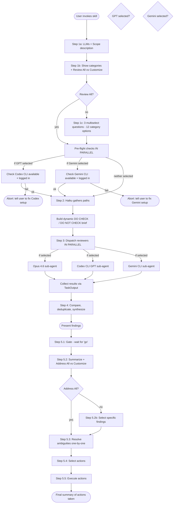
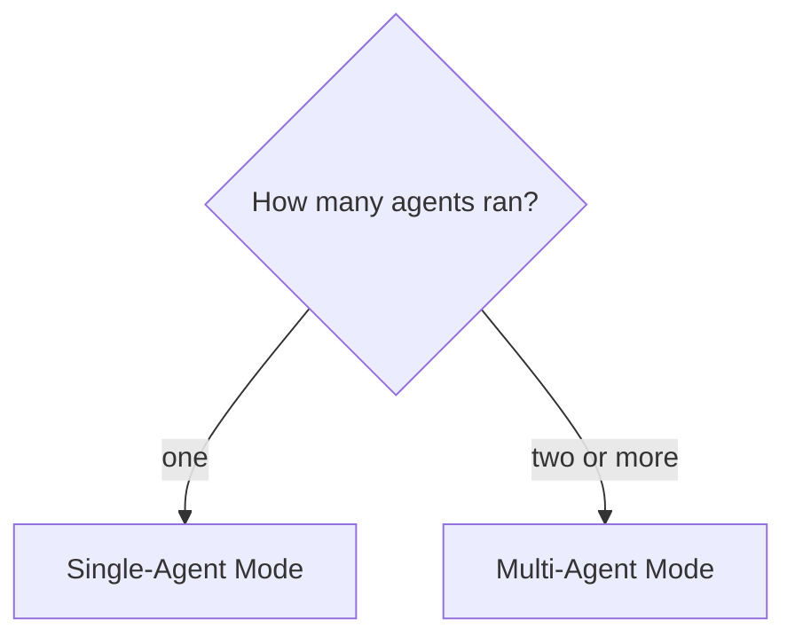

# Review Documentation

Multi-LLM documentation review for catching inconsistencies, codebase mismatches, and gaps.

## When to Use

- After an LLM generates or updates documentation
- Before implementing a spec or task list
- When reviewing PRDs, plans, or beads issue epics
- When documentation references code that may have changed

## Workflow



## Step 0: Pre-flight Checks (if GPT or Gemini selected)

**Run pre-flight checks IN PARALLEL for all selected external CLI agents.**

### GPT Pre-flight (if GPT selected)

```bash
# Check Codex CLI is installed
command -v codex >/dev/null 2>&1 || { echo "Codex CLI not installed"; exit 1; }

# Test the actual model - this validates auth AND model availability
codex exec -m "gpt-5.3-codex" -c reasoning_effort="high" --sandbox workspace-write "Respond with only: READY" 2>&1
```

**Check the output for:**

- ✓ "READY" in response = model works, proceed
- ✗ "not supported" or auth errors = model unavailable

**If check fails, STOP and tell the user:**

> "Codex CLI check failed. Either the CLI is not installed, you're not logged in (`codex login`), or the gpt-5.3-codex model is not available with your account. Select Opus 4.6 only for this review, or fix your Codex setup first."

### Gemini Pre-flight (if Gemini selected)

```bash
# Check Gemini CLI is installed
command -v gemini >/dev/null 2>&1 || { echo "Gemini CLI not installed"; exit 1; }

# Test the actual model
gemini "Respond with only: READY" --model gemini-3-pro-preview --sandbox -y 2>&1
```

**Check the output for:**

- ✓ "READY" in response = model works, proceed
- ✗ Errors about authentication or model unavailable

**If check fails, STOP and tell the user:**

> "Gemini CLI check failed. Select Opus 4.6 only, or fix your Gemini setup first."

**Do NOT dispatch any sub-agents until all pre-flight checks pass.**

## Step 1: Get Scope from User (FAST)

**CRITICAL: Do NOT explore the codebase yourself. Just collect scope from user.**

### Step 1a: Get Scope Description

Ask the user for scope (free text):

> "What documentation should I review? (e.g., "Phase 5 beads documentation", "specs/auth.md", "all tasks under epic cgt-22")"

### Step 1b: Configuration (Single Batched AskUserQuestion)

**Batch all configuration into ONE AskUserQuestion call with 3 questions.** Users can tab through efficiently:

```
questions: [
  {
    question: "Which models should perform this review?",
    header: "Models",
    multiSelect: true,
    options: [
      { label: "Opus 4.6 (Recommended)", description: "Claude Opus 4.6 - strong reasoning, nuanced analysis" },
      { label: "GPT 5.3 Codex", description: "OpenAI's latest via Codex CLI - different perspective" },
      { label: "Gemini 3 Pro", description: "Google's latest via Gemini CLI - third perspective" }
    ]
  },
  {
    question: "Review mode?",
    header: "Categories",
    multiSelect: false,
    options: [
      { label: "Review All (Recommended)", description: "Check all categories: accuracy, design, robustness" },
      { label: "Customize", description: "Select specific categories to review" }
    ]
  },
  {
    question: "Run CLI pre-flight checks for GPT/Gemini?",
    header: "Pre-flight",
    multiSelect: false,
    options: [
      { label: "Skip (Recommended)", description: "Assume CLIs work - faster startup" },
      { label: "Run checks", description: "Verify Codex/Gemini CLIs are working before dispatch" }
    ]
  }
]
```

**This reduces LLM round-trips from multiple separate questions to 1 batched interaction.**

### Handling Configuration Results

**Single Model Warning:**
If user selects only 1 model, show a follow-up warning:

```
question: "Only 1 model selected. Multi-model comparison provides better coverage. Proceed?"
header: "Single Model"
multiSelect: false
options:
  - label: "Add another model (Recommended)"
    description: "Go back and select additional models for comparison"
  - label: "Continue with 1 model"
    description: "Get review from single model (no comparison)"
```

**Review Mode Handling:**

- **"Review All":** Skip to Step 2 with defaults:
  - Codebase Match ✓
  - Cross-Document Consistency ✓
  - API & Interface Assumptions ✓
  - Security Concerns ✓
  - Design Quality ✓
  - TDD Alignment ✓
  - Project Standards ✓

- **"Customize":** Show the 3 multiselect questions below.

**Pre-flight Handling:**

- **"Skip":** Proceed directly to dispatch - trust that CLIs work
- **"Run checks":** Execute pre-flight checks (Step 0) before dispatch

### Step 1c: Review Categories (if customizing - 3 multiselect questions)

Ask the user which review categories to include using THREE questions for granular control (12 toggleable options):

**Question 1: Accuracy & Correctness**

```
question: "Which accuracy checks should agents perform?"
header: "Accuracy"
multiSelect: true
options:
  - label: "Codebase Match (Recommended)"
    description: "Does documentation match actual code? File paths correct?"
  - label: "Cross-Document Consistency (Recommended)"
    description: "Are different documents consistent with each other?"
  - label: "API & Interface Assumptions (Recommended)"
    description: "Are assumptions about APIs, tools, external services correct?"
  - label: "Security Concerns (Recommended)"
    description: "Missing auth, exposed secrets, injection risks, OWASP issues"
```

**Question 2: Design & Standards**

```
question: "Which design/standards checks should agents perform?"
header: "Design"
multiSelect: true
options:
  - label: "Design Quality (Recommended)"
    description: "Suitability, YAGNI, DRY - is the design appropriate?"
  - label: "TDD Alignment (Recommended)"
    description: "Does the plan account for testing? Test-first or afterthought?"
  - label: "Project Standards (Recommended)"
    description: "Alignment with CLAUDE.md, agents.md, documented conventions"
  - label: "Architectural Consistency"
    description: "Does the approach fit existing architecture and patterns?"
```

**Question 3: Robustness & Validation**

```
question: "Which robustness/validation checks should agents perform?"
header: "Robustness"
multiSelect: true
options:
  - label: "Error Handling & Edge Cases"
    description: "Failure scenarios, API failures, missing data, invalid inputs"
  - label: "Performance"
    description: "N+1 queries, unbounded loops, missing pagination, algorithms"
  - label: "Data & Schema Validity"
    description: "Schema match, column types, foreign keys, constraints"
  - label: "Task Dependencies & Completeness"
    description: "Beads dependencies correct? Parallelizable? Critical path? Task status accuracy?"
```

**Default behavior:** Items marked "(Recommended)" are typical defaults - first 7 options. User can toggle any combination.

**Time budget for Step 1: Under 45 seconds total.** You're collecting descriptions, not files.

## Step 2: Haiku Gathers Paths (FAST)

**Dispatch a Haiku subagent to discover relevant paths from the scope description.**

This is the ONLY exploration step - and it's delegated to a fast, cheap agent.

### Epic Disambiguation

**CRITICAL: If scope description matches multiple epics (e.g., multiple "Phase 6" epics), Haiku MUST:**
1. List ALL matching epics with their titles and IDs
2. Return structured output with a `DISAMBIGUATION_NEEDED` flag if multiple matches
3. Include epic titles to help distinguish (e.g., "Phase 6 Artifacts & Downloads" vs "Phase 6 Asset Equivalences")

**If disambiguation is needed**, present candidates to user:
```
question: "Multiple matching epics found. Which one should I review?"
header: "Epic"
multiSelect: false
options:
  [Dynamically populate with epic ID + title for each match]
```

Then re-run Haiku with the specific epic ID.

```
Task(
  subagent_type="Explore",
  model="haiku",
  prompt="Find all relevant documentation paths for: [USER'S SCOPE DESCRIPTION]

Target codebase: [PATH]

Return ONLY a structured list of paths. Do NOT read file contents.

Look in:
- .beads/ directory for matching issue IDs (use bd list to find relevant IDs)
- specs/ or docs/ directories for matching markdown files
- CLAUDE.md, README.md, or similar project docs
- Any paths explicitly mentioned in the scope description

Output format:
BEADS_IDS: cgt-22, cgt-11, cgt-16, ...
FILE_PATHS: /path/to/spec.md, /path/to/design.md, ...

Be thorough but fast. Paths only, no content."
)
```

**Wait for Haiku to return** (typically 15-30 seconds), then proceed to Step 2b.

## Step 2b: Pre-Read Beads Issues

**Always pre-read beads issues to include in both Opus and GPT prompts.**

This speeds up the review by providing spec context upfront, reducing tool calls during review.

```bash
# For each issue ID from Haiku:
bd show cgt-XX
bd show cgt-YY
# ... etc
```

Store the output and include it verbatim in both sub-agent prompts under `## Beads Issue Contents (Pre-Read)`.

**Note:** GPT can still explore additional issues (dependencies, linked issues) using `bd` commands if needed during review.

## Step 3: Dispatch Reviewers (PARALLEL)

**CRITICAL: All agents MUST use `run_in_background: true` for true parallelism.**

**Special Note on Gemini:** Gemini requires a TWO-STEP approach to avoid JSON serialization issues:
1. First, write the prompt to a temp file (quick sync Bash call)
2. Then, call gemini reading from the temp file (background Bash call)

See "Dispatching Gemini Sub-Agent" section below for details.

```
# Dispatch sequence:

# Step 1: Write Gemini prompt to temp file (sync, fast)
Bash(command="cat > /tmp/gemini_prompt.txt <<'EOF' ... EOF")

# Step 2: In ONE message, dispatch ALL reviewers with run_in_background: true:
Task(
  subagent_type="general-purpose",
  model="opus",
  run_in_background=true,    # <-- REQUIRED
  prompt="..."
)

Bash(
  command="codex exec ...",
  run_in_background=true,    # <-- REQUIRED
  timeout=900000
)

Bash(
  command="gemini \"$(cat /tmp/gemini_prompt.txt)\" ...",
  run_in_background=true,    # <-- REQUIRED
  timeout=900000
)
```

**If you forget `run_in_background: true` on any call, they will NOT run in parallel.**

### Sub-Agent Brief (DYNAMIC - build based on user selections)

Build the brief dynamically based on which categories the user selected from the THREE questions (12 possible categories). Include ONLY the selected categories in the "DO CHECK" section, and explicitly list skipped categories in the "DO NOT CHECK" section.

**Template:**

```
You are reviewing documentation for accuracy, completeness, and quality.

## IMPORTANT: Review Only - No Changes

**DO NOT modify any files during this review phase.**

This is a READ-ONLY review for context gathering and gap identification. Your role is to:
- Read and analyze documentation
- Compare documentation against codebase
- Identify gaps and issues
- Report findings

Any actual fixes will be made in Step 5 after user reviews and approves findings.
Do NOT use Edit, Write, or any file modification tools.

## Verification Requirement

**CRITICAL: Do NOT make assumptions about how the codebase works. VERIFY by reading code.**

Before stating how something works (e.g., "the CLI is workspace-agnostic"):
1. Read the actual code that implements it
2. Quote specific lines/functions that prove your assertion
3. If you cannot verify by reading code, mark as UNVERIFIED and flag for human review

Common assumption mistakes to avoid:
- Assuming a component hasn't changed since last review
- Inferring behavior from naming conventions without reading implementation
- Stating capabilities without checking the actual code

## DO CHECK - Review these categories:

[Include ONLY the categories the user selected from Step 1b questions]

### Codebase Match (if selected)
- Does the documentation match what's in the codebase?
- Are there gaps or ambiguities between what's documented and what exists?
- Are all file paths mentioned correct and existing?

### Cross-Document Consistency (if selected)
- Are different documents consistent with each other?
- Do we describe something one way in the spec but differently elsewhere?

### API & Interface Assumptions (if selected)
- Are assumptions about APIs, tool interfaces, or external services correct?
- If unsure about library/API usage, use Context7 to verify. Not required for well-known patterns.

### Security Concerns (if selected)
- Are there security issues in the planned approach?
- Missing auth, exposed secrets, injection risks, OWASP top 10 issues?

### Design Quality (if selected)
- Is the design appropriate? Over-engineered or under-engineered? Simpler alternatives?
- YAGNI - unnecessary features, abstractions, or complexity?
- DRY - duplication or missed reuse opportunities?

### TDD Alignment (if selected)
- Does the plan account for testing?
- Is there a test-first approach or are tests an afterthought?
- Are test scenarios defined for edge cases?

### Project Standards (if selected)
- Check CLAUDE.md, agents.md, constitution.md, or similar project config files
- Does the plan align with documented principles and conventions?

### Architectural Consistency (if selected)
- Does the approach fit existing architecture and patterns?
- Does it follow established patterns or introduce inconsistent new patterns?

### Error Handling & Edge Cases (if selected)
- Does the plan account for failure scenarios?
- What happens when APIs fail, data is missing, inputs are invalid?
- Are error states defined?

### Performance (if selected)
- N+1 queries, unbounded loops, missing pagination?
- Large payloads, inefficient algorithms, missing indexes?
- Backwards compatibility - breaking changes, migration paths needed?

### Data & Schema Validity (if selected)
- Do proposed structures match existing schemas?
- Column types, foreign keys, constraints correct?
- Do migrations preserve data integrity?

### Task Dependencies & Completeness (if selected)
- Are beads/task dependencies correct and accurate?
- Can tasks marked as parallelizable actually run in parallel?
- Is the critical path correctly identified?
- Are task statuses accurate (closed tasks actually complete)?
- Are blockers correctly marked?

## DO NOT CHECK - Skip these categories:

[List any categories the user did NOT select]

- [Category name]: User explicitly excluded this from review scope. Do not report issues in this area.

## Output Format

Return a RISK-WEIGHTED bullet list. Order by severity (CRITICAL > HIGH > MEDIUM > LOW).

For each issue:
- **[SEVERITY] Issue Title**
  - What: Description of the problem
  - Where: File/document/task affected
  - Evidence: What you found that indicates this issue
  - Recommendation: Specific fix

End with a brief summary of total issues by severity.
```

**Example: User selected only "Codebase Match", "Security Concerns", "Design Quality", and "Task Dependencies & Completeness":**

```
## DO CHECK - Review these categories:

### Codebase Match
- Does the documentation match what's in the codebase?
- Are there gaps or ambiguities?
- Are all file paths correct?

### Security Concerns
- Missing auth, exposed secrets, injection risks?

### Design Quality
- Is the design appropriate? YAGNI, DRY?

### Task Dependencies & Completeness
- Are beads dependencies correct?
- Can parallel tasks actually parallelize?
- Are task statuses accurate?

## DO NOT CHECK - Skip these categories:

- **Cross-Document Consistency**: User excluded. Do not report.
- **API & Interface Assumptions**: User excluded. Do not report.
- **TDD Alignment**: User excluded. Do not report.
- **Project Standards**: User excluded. Do not report.
- **Architectural Consistency**: User excluded. Do not report.
- **Error Handling & Edge Cases**: User excluded. Do not report.
- **Performance**: User excluded. Do not report.
- **Data & Schema Validity**: User excluded. Do not report.
```

### Dispatching Opus Sub-Agent

```
Task(
  subagent_type="general-purpose",
  model="opus",
  run_in_background=true,
  prompt="[Sub-agent brief above]

Documentation to review:
- Beads issues: [BEADS_IDS from Haiku]
- Files: [FILE_PATHS from Haiku]

## Beads Issue Contents (Pre-Read)

[PASTE VERBATIM OUTPUT FROM `bd show` FOR EACH ISSUE HERE]

Target codebase: /path/to/project

## How to explore additional beads issues

The main beads issues are provided above. If you need to explore dependencies or linked issues:
- bd show <id> - View issue details
- bd dep show <id> - View issue dependencies

Use Read tool for markdown files.
Explore the codebase as needed to validate documentation accuracy.

REMINDER: This is a READ-ONLY review phase. Do NOT modify any files. Changes are made in Step 5 after user approval."
)
```

### Dispatching GPT Sub-Agent via Codex CLI

**CRITICAL: The Bash call MUST have `run_in_background: true`**

```bash
# Bash tool call parameters:
#   command: "codex exec ..."
#   run_in_background: true    <-- REQUIRED FOR PARALLEL EXECUTION
#   timeout: 900000            <-- 15 minutes (GPT reviews can take time)

codex exec -m "gpt-5.3-codex" -c reasoning_effort="high" --sandbox workspace-write "$(cat <<'PROMPT'
[Sub-agent brief above]

Documentation to review:
- Beads issues: [BEADS_IDS from Haiku]
- Files: [FILE_PATHS from Haiku]

## Beads Issue Contents (Pre-Read)

[PASTE VERBATIM OUTPUT FROM `bd show` FOR EACH ISSUE HERE]

Target codebase: [current working directory]

## How to explore additional beads issues

The main beads issues are provided above. If you need to explore dependencies or linked issues:
- bd show <id> - View issue details
- bd dep show <id> - View issue dependencies
- bd list --status=open - List open issues

## Shell Command Best Practices

**CRITICAL: Path quoting**
Always wrap file paths containing special characters in single quotes:
- Parentheses: `(dashboard)`
- Brackets: `[slug]`
- Spaces

Example:
```bash
# WRONG - will fail
sed -n '1,100p' apps/web/app/(dashboard)/workspace/[slug]/page.tsx

# CORRECT
sed -n '1,100p' 'apps/web/app/(dashboard)/workspace/[slug]/page.tsx'
```

**Avoid login shell flag**
When running shell commands, prefer non-login shell:
```bash
/bin/zsh -c 'command'  # Preferred - non-login shell
```
Avoid login shell (`-l` flag) as it may trigger profile errors in sandbox environments.

## Time Management

This review may take 10-15 minutes. Take your time to:
1. Read all relevant files thoroughly
2. Cross-reference documentation against codebase
3. Build a complete findings list

Don't rush - thoroughness is more important than speed.

## Review process

1. Read the beads issue contents provided above
2. If needed, explore dependencies or linked issues using bd commands
3. Read any markdown files directly
4. Explore the codebase to validate documentation accuracy
5. Return findings in the specified output format

REMINDER: This is a READ-ONLY review phase. Do NOT modify any files. Changes are made in Step 5 after user approval.
PROMPT
)"
```

**Notes on Codex CLI:**

- Model: `gpt-5.3-codex` with high reasoning effort
- `--sandbox workspace-write` - can read/write files in workspace, run shell commands (including `bd` which needs SQLite WAL write access)
- **Timeout:** Set Bash timeout to 15 minutes (`timeout: 900000` ms) - GPT reviews can take time
- **Background:** Use `run_in_background: true` on the Bash call - THIS IS CRITICAL
- Beads issues are pre-read in Step 2b and passed in prompt, but GPT can explore additional issues with `bd` if needed

### Dispatching Gemini Sub-Agent via Gemini CLI

**CRITICAL: Use the TWO-STEP temp file approach to avoid JSON serialization issues with complex prompts.**

**WHY:** When the executing LLM constructs a Bash tool call containing a long HEREDOC with markdown, code blocks, and special characters, the JSON serialization can break (resulting in "Invalid tool parameters"). Using a temp file separates the complex prompt content from the shell command.

**IMPORTANT: Gemini runs in `permissive-open` sandbox mode by default (allows writes to project folder). The prompt explicitly instructs Gemini NOT to modify files during review phase.**

**Step 1: Write prompt to temp file (first Bash call)**

```bash
# Bash tool call parameters:
#   command: "cat > /tmp/gemini_review_prompt.txt <<'GEMINI_PROMPT' ... "
#   run_in_background: false    <-- This is fast, no need for background
#   timeout: 30000              <-- 30 seconds is plenty

cat > /tmp/gemini_review_prompt.txt <<'GEMINI_PROMPT'
[Sub-agent brief above]

Documentation to review:
- Beads issues: [BEADS_IDS from Haiku]
- Files: [FILE_PATHS from Haiku]

## Beads Issue Contents (Pre-Read)

[PASTE VERBATIM OUTPUT FROM `bd show` FOR EACH ISSUE HERE]

Target codebase: [current working directory]

## How to explore additional beads issues

The main beads issues are provided above. If you need to explore dependencies or linked issues:
- bd show <id> - View issue details
- bd dep show <id> - View issue dependencies
- bd list --status=open - List open issues

## Shell Command Best Practices

**CRITICAL: Path quoting**
Always wrap file paths containing special characters in single quotes:
- Parentheses: `(dashboard)`
- Brackets: `[slug]`
- Spaces

Example:
```bash
# WRONG - will fail
cat apps/web/app/(dashboard)/workspace/[slug]/page.tsx

# CORRECT
cat 'apps/web/app/(dashboard)/workspace/[slug]/page.tsx'
```

## Time Management

This review may take 10-15 minutes. Take your time to:
1. Read all relevant files thoroughly
2. Cross-reference documentation against codebase
3. Build a complete findings list

Don't rush - thoroughness is more important than speed.

## Review process

1. Read the beads issue contents provided above
2. If needed, explore dependencies or linked issues using bd commands
3. Read any markdown files directly
4. Explore the codebase to validate documentation accuracy
5. Return findings in the specified output format

REMINDER: This is a READ-ONLY review phase. Do NOT modify any files. Changes are made in Step 5 after user approval.
GEMINI_PROMPT
```

**Step 2: Call Gemini reading from temp file (second Bash call, IN PARALLEL with Opus/GPT)**

```bash
# Bash tool call parameters:
#   command: "gemini \"$(cat /tmp/gemini_review_prompt.txt)\" ..."
#   run_in_background: true     <-- REQUIRED FOR PARALLEL EXECUTION
#   timeout: 900000             <-- 15 minutes

gemini "$(cat /tmp/gemini_review_prompt.txt)" --model gemini-3-pro-preview --sandbox -y && rm /tmp/gemini_review_prompt.txt
```

**Notes on Gemini CLI:**

- Model: `gemini-3-pro-preview`
- `--sandbox` uses `permissive-open` mode by default (allows writes to project folder, but prompt prohibits modifications)
- **Timeout:** Set Bash timeout to 15 minutes (`timeout: 900000` ms)
- **Background:** Use `run_in_background: true` on the Bash call - THIS IS CRITICAL
- Beads issues are pre-read in Step 2b and passed in prompt
- The `&& rm` cleanup runs after Gemini completes

### Collecting Results

After dispatching all selected agents in background, use `TaskOutput` to collect results.

**CRITICAL: Call ALL TaskOutput calls IN PARALLEL in ONE message.**

If you call them sequentially, the main thread blocks on each one, wasting time. Call them all in a single message:

```
# In ONE message, call all TaskOutput tools in parallel:
TaskOutput(task_id="<opus_task_id>", block=true, timeout=900000)
TaskOutput(task_id="<codex_task_id>", block=true, timeout=900000)
TaskOutput(task_id="<gemini_task_id>", block=true, timeout=900000)
```

**Timeouts:** Use 900000ms (15 minutes) for all agents. Reviews take time - don't give up early.

This keeps the main conversation context clean while agents work.

**Do NOT timeout prematurely.** When waiting for results:
- Use `timeout: 900000` (15 minutes) for all agents
- If one agent times out but others succeed, note this in the output and proceed
- Do NOT poll repeatedly - call TaskOutput ONCE with blocking mode and let it wait

**If you get a timeout and suspect the agent is still running:**
1. Wait an additional 2-3 minutes
2. Try TaskOutput again with `block: false` to check status
3. Only proceed to synthesis when you have actual results (or confirmed failure)

### Handling Failures

**Known Sandbox Errors (Ignorable):**

These stderr messages can be safely ignored - they don't affect command execution:
- `/opt/homebrew/Library/Homebrew/help.sh: cannot create temp file` - Homebrew shell integration failing in sandbox
- Similar brew/nvm/pyenv/rbenv profile errors
- Any "Operation not permitted" errors from shell profile scripts

Only treat as actual failures:
- Command exit codes ≠ 0
- Missing expected output
- Actual tool/permission errors (not profile initialization errors)

**If GPT fails (rate limits, API errors, etc.):**

1. **NOTIFY the user explicitly** - don't silently proceed with fewer agents
2. Present options:
   ```
   question: "GPT review failed due to [error]. How should we proceed?"
   header: "Fallback"
   multiSelect: false
   options:
     - label: "Continue with remaining agents"
       description: "Proceed with available agents (reduced cross-validation)"
     - label: "Retry GPT"
       description: "Attempt the GPT review again"
     - label: "Abort review"
       description: "Stop and investigate the issue"
   ```
3. Record the failure in the final output

**If Gemini fails (rate limits, API errors, etc.):**

1. **NOTIFY the user explicitly** - don't silently proceed with fewer agents
2. Present options:
   ```
   question: "Gemini review failed due to [error]. How should we proceed?"
   header: "Fallback"
   multiSelect: false
   options:
     - label: "Continue with remaining agents"
       description: "Proceed with available agents (reduced cross-validation)"
     - label: "Retry Gemini"
       description: "Attempt the Gemini review again"
     - label: "Abort review"
       description: "Stop and investigate the issue"
   ```
3. Record the failure in the final output

**Never silently fall back to fewer agents** - the user should know if they're missing cross-validation.

### Transition to Synthesis

**Once all TaskOutput calls return (or timeout/fail):**

1. **Do NOT do additional exploration** - use only what agents returned
2. **Do NOT supplement with your own reads** - synthesis uses agent outputs only
3. **Proceed IMMEDIATELY to Step 4** - don't add extra investigation
4. **If results are incomplete**, note gaps in the synthesis rather than trying to fill them

## Step 4: Synthesize Results

After collecting results from sub-agents, follow the appropriate path:



---

### Single-Agent Mode (one LLM only)

If only one agent ran (user choice or other agents unavailable):

1. **Present findings directly** - no comparison needed
2. **Skip the comparison table** - not applicable
3. **Add your own analysis** - review the agent's findings and note any you disagree with or want to highlight
4. **Note the limitation** - mention that cross-validation wasn't performed

---

### Multi-Agent Mode (multiple LLMs)

#### 4.1 Deduplicate Issues

Create a merged list, removing duplicates where multiple agents identified the same issue.

#### 4.2 Create Comparison Table

| #   | Issue         | Opus           | GPT           | Gemini         | Agree?         | Recommendation   |
| --- | ------------- | -------------- | ------------- | -------------- | -------------- | ---------------- |
| 1   | [Issue title] | [Opus finding] | [GPT finding] | [Gemini finding] | Yes/No/Partial | [Your synthesis] |

(Include only columns for agents that were selected/succeeded)

**Table Formatting Guidelines:**

- **Keep cell content concise** - under 30 characters per cell where possible
- **Use severity as shorthand** - e.g., "HIGH - missing validation" not a full paragraph
- **If content is too long**, summarize in table and reference "See issue #X above" for full details
- **Test table renders correctly** before presenting to user
- **Use consistent column widths** - don't let one cell dominate

For each row:

- **Agree?** - Do all agents agree on the issue and severity?
- **Recommendation** - Your synthesized recommendation considering all perspectives

#### 4.3 Reasoning Section

For each issue in the table, provide:

- Why you agree or disagree with each agent's assessment
- If agents disagree, which assessment is more accurate and why
- The final recommended action

---

### 4.4 Remaining Ambiguities (both modes)

List any:

- Unresolved questions that need human clarification
- Areas where neither agent had sufficient context
- Items requiring further investigation
- Dependencies on external information not available

## Output Format

### Multi-Agent Output

```markdown
# Documentation Review: [Document/Epic Name]

## Review Configuration

- **LLMs Used:** [List agents used, e.g., "Opus + GPT + Gemini" / "Opus only" / "Opus + Gemini"]
- **Documents Reviewed:** [List]
- **Codebase:** [Path or N/A]
- **Categories Checked:** [List selected categories]
- **Categories Skipped:** [List unselected categories, or "None"]

## Synthesized Issues (Risk-Weighted)

### CRITICAL

- [Deduplicated critical issues with recommendations]

### HIGH

- [Deduplicated high issues]

### MEDIUM

- [Deduplicated medium issues]

### LOW

- [Deduplicated low issues]

## Agent Comparison

| #   | Issue | Opus | GPT | Gemini | Agree? | Recommendation |
| --- | ----- | ---- | --- | ------ | ------ | -------------- |
| ... |

(Include only columns for agents that were selected/succeeded)

## Reasoning

[For each issue, explain agreement/disagreement and final position]

## Remaining Ambiguities

- [List unresolved questions]
- [Areas needing human input]
- [Items for further investigation]

## Summary

- **Total Issues:** X (Y critical, Z high, ...)
- **Agent Agreement Rate:** X%
- **Next Steps:** [Prioritized action items]
```

### Single-Agent Output

```markdown
# Documentation Review: [Document/Epic Name]

## Review Configuration

- **LLMs Used:** [Opus 4.6 / GPT 5.3 Codex / Gemini 3 Pro] (single agent)
- **Documents Reviewed:** [List]
- **Codebase:** [Path or N/A]
- **Note:** Cross-validation not performed (single agent review)

## Issues (Risk-Weighted)

### CRITICAL

- [Critical issues with recommendations]

### HIGH

- [High issues]

### MEDIUM

- [Medium issues]

### LOW

- [Low issues]

## Additional Analysis

[Your own observations on the agent's findings - agreements, disagreements, highlights]

## Remaining Ambiguities

- [List unresolved questions]
- [Areas needing human input]
- [Items for further investigation]

## Summary

- **Total Issues:** X (Y critical, Z high, ...)
```

## Step 5: Next Steps (Interactive)

After presenting findings, guide the user through actioning them.

### 5.1 Gate: Let User Digest Findings

After presenting the synthesized findings, pause:

> "Review complete. Say **'go'** when you're ready to discuss next steps."

**Wait for user to respond.** Do not proceed until they acknowledge.

### 5.2 Select Concerns to Address (fast-track or customize)

**First, summarize the findings:**

> "Found X issues: Y critical, Z high, W medium, V low."

**Then ask (single choice):**

```
question: "How would you like to proceed?"
header: "Findings"
multiSelect: false
options:
  - label: "Address All Issues (Recommended)"
    description: "Work through all identified issues"
  - label: "Customize"
    description: "Select specific issues to address"
```

**If "Address All":** Proceed to Step 5.3 with all findings selected.

**If "Customize":** Show the multiselect of individual findings:

```
question: "Which findings do you want to address?"
header: "Select Issues"
multiSelect: true
options:
  [Dynamically populate from the identified issues - each issue becomes an option]
  - label: "[SEVERITY] Issue title"
    description: "Brief summary of the issue"
```

### 5.3 Resolve Ambiguities (if any in selected concerns)

For each ambiguity in the selected concerns, present **one at a time**:

```
[Present the ambiguity context - what's unclear and why it matters]

question: "How should this be resolved?"
header: "Ambiguity"
multiSelect: false
options:
  - label: "[Recommended approach] (Recommended)"
    description: "Why this is recommended"
  - label: "[Alternative 1]"
    description: "Trade-offs of this approach"
  - label: "[Alternative 2]"
    description: "Trade-offs of this approach"
  - label: "Skip - decide later"
    description: "Leave unresolved for now"
```

Record each resolution for use in subsequent actions.

### 5.4 Select Actions

Ask user what actions to take on their selected concerns:

```
question: "What actions do you want to take?"
header: "Actions"
multiSelect: true
options:
  - label: "Create beads issues"
    description: "Track findings as beads issues for later resolution"
  - label: "Save review to markdown"
    description: "Save full review to docs/reviews/[name].md"
  - label: "Fix documentation"
    description: "Update docs/beads to match reality or resolve inconsistencies"
  - label: "Fix code issues" (only show if code issues were identified)
    description: "Update code to match documented intent"
```

### 5.5 Execute Selected Actions

#### If "Create beads issues" selected:

Ask how to structure the issues:

```
question: "How should the beads issues be structured?"
header: "Structure"
multiSelect: false
options:
  - label: "Epic with task breakdown (Recommended)"
    description: "One epic for the review, individual tasks for each finding"
  - label: "Individual issues"
    description: "Separate standalone issue for each finding"
  - label: "Single consolidated issue"
    description: "One issue listing all findings"
```

Then create the beads issues accordingly using `bd create`.

#### If "Save review to markdown" selected:

Ask for the review name:

> "What should this review be called? (will be saved to `docs/reviews/[name].md`)"

Save the full review output to the specified path.

#### If "Fix documentation" selected:

Apply fixes to all selected concerns that have documentation issues:

- Update markdown files to resolve inconsistencies
- Update beads issues via `bd update` to correct descriptions/status
- Fix file path references
- Resolve cross-document inconsistencies

No per-issue confirmation needed - user already selected the findings they care about.

#### If "Fix code issues" selected:

Apply fixes to all selected concerns that have code issues:

- Update code to match documented intent
- Fix API mismatches
- Resolve schema/data issues

No per-issue confirmation needed - user already selected the findings they care about.

#### 5.5b Verify Applied Fixes

**After applying fixes (documentation or code), verify they were applied correctly:**

1. **Re-read each modified file** to confirm changes applied as intended
2. **Check for syntax issues** - ensure markdown renders, code compiles
3. **Summarize diffs** - briefly note what changed in each file for user awareness

Example verification:
```
Verifying fixes...
- specs/auth.md: ✓ Updated multi-account section (lines 45-52)
- packages/core/adapter.ts: ✓ Extended TransactionType enum
- .beads/cgt-123.md: ✓ Updated status to reflect current state
```

**If any fix failed to apply**, note it in the summary and suggest manual intervention.

### 5.6 Summary

After executing all selected actions, summarize what was done:

```markdown
## Actions Taken

- **Ambiguities resolved:** X of Y
- **Beads issues created:** [list issue IDs if created]
- **Review saved to:** [path if saved]
- **Documentation fixes applied:** X
- **Code fixes applied:** X
- **Deferred for manual action:** [list any skipped items]
```

## Execution Checklist

**Use TodoWrite to track each step:**

- [ ] Asked user which LLMs to use + scope description (Step 1a)
- [ ] Showed categories and asked Review All vs Customize (Step 1b)
- [ ] If Customize: asked user which review categories (Step 1c - 3 multiselect questions, 12 options)
- [ ] Pre-flight checks passed IN PARALLEL (if GPT or Gemini selected)
- [ ] Dispatched Haiku to gather paths
- [ ] Received path list from Haiku (if disambiguation needed, asked user)
- [ ] Pre-read beads issues with `bd show` (Step 2b)
- [ ] Built dynamic sub-agent brief with DO CHECK / DO NOT CHECK sections
- [ ] Dispatched ALL selected reviewers with `run_in_background: true` in ONE message (included pre-read beads in prompts)
- [ ] Collected results using TaskOutput (block: true)
- [ ] If any agent failed: notified user and asked how to proceed (don't silently fallback)
- [ ] Created deduplicated issue list (multi-agent) OR presented findings (single-agent)
- [ ] Created comparison table (multi-agent only)
- [ ] Wrote reasoning (multi-agent) OR additional analysis (single-agent)
- [ ] Listed remaining ambiguities
- [ ] Produced final summary
- [ ] Gated: waited for user to say "go" before next steps
- [ ] Summarized findings and asked Address All vs Customize (Step 5.2)
- [ ] If Customize: asked user which specific findings to address
- [ ] Resolved ambiguities one-by-one (if any in selected findings)
- [ ] Asked user which actions to take (multiselect)
- [ ] Executed selected actions (beads, markdown, fixes)
- [ ] Verified applied fixes (re-read files, check syntax, summarize diffs)
- [ ] Presented final summary of actions taken

**CRITICAL: Do not skip the synthesis phase.** Raw agent output is NOT the deliverable.

## Common Mistakes

| Mistake                     | Correction                                                                     |
| --------------------------- | ------------------------------------------------------------------------------ |
| Exploring codebase yourself | Haiku gathers paths - you just pass the scope description                      |
| Missing `run_in_background` | BOTH Task and Bash calls MUST have `run_in_background: true`                   |
| Sequential dispatch         | Use ONE message with multiple tool calls (Task + Bash) for true parallel       |
| Asking user for file list   | Ask for scope DESCRIPTION - Haiku discovers the actual paths                   |
| Codex blocking main thread  | Codex Bash call needs `run_in_background: true` just like Task                 |
| Not waiting for Haiku       | Wait for Haiku's path list before dispatching reviewers                        |
| Not checking codebase       | Always verify documentation against actual code if a codebase exists           |
| Overusing Context7          | Only use when unsure about library/API usage - not for well-known patterns     |
| Surface-level review        | Review must be comprehensive - check every file path, every API assumption     |
| Missing synthesis           | Raw agent output isn't enough - you must compare, contrast, and reason through |
| Dumping raw output          | Agent results must be processed into comparison table with reasoning           |
| Skipping Review All option  | Always offer fast-track first - only show detailed questions if user picks Customize |
| **Not disambiguating epics** | If multiple epics match (e.g., multiple "Phase 6"), ask user which one |
| **Not pre-reading beads issues** | Always pre-read with `bd show` and include in all agent prompts |
| **Making technical assumptions** | Don't assume how code works - READ it and quote specific lines |
| **Silent rate limit fallback** | If any agent fails, NOTIFY user explicitly before proceeding with remaining agents |
| **Modifying files during review** | Review phase is READ-ONLY - no Edit/Write calls, fixes come in Step 5 |
| **Premature timeout** | Use 900000ms (15 min) timeout for all agents - don't give up after 2-5 minutes |
| **Unquoted special paths** | Always single-quote paths with `()`, `[]`, or spaces |
| **Treating sandbox stderr as errors** | Homebrew/profile errors in stderr are ignorable - check exit codes instead |
| **Sequential pre-flight checks** | Run GPT and Gemini pre-flight checks IN PARALLEL, not sequentially |
| **Gemini sandbox writes** | Gemini uses `permissive-open` sandbox - prompt explicitly prohibits file modifications |
| **Inline Gemini HEREDOC** | Use TWO-STEP temp file approach - write prompt to file first, then call gemini |
| **Sequential TaskOutput calls** | Call ALL TaskOutput in ONE message for parallel collection |
| **Extra exploration after collection** | Proceed IMMEDIATELY to synthesis - don't supplement with your own reads |
| **Skipping fix verification** | After applying fixes, re-read files and summarize diffs |
| **Table cell overflow** | Keep comparison table cells under 30 chars - summarize and reference full details above |
