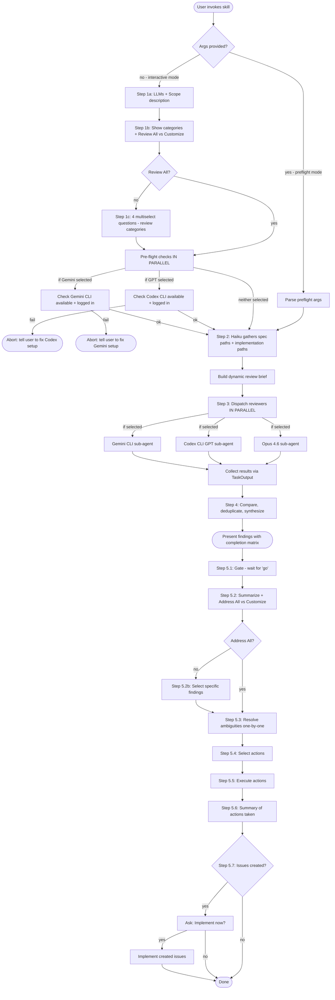

# Review Implementation

Multi-LLM implementation review for verifying code matches spec, identifying gaps, and tracking completion state.

## CRITICAL: Arg Detection (Read First)

**When this skill is invoked, check IMMEDIATELY if args were provided.**

### How to Detect Args

When invoked via `Skill(skill="review-implementation", args="...")`, the args string appears in your context. Look for any of these patterns:

1. **Direct arg string** - A line like: `--models opus,gpt,gemini --categories all --scope-spec "epic cgt-22" --scope-impl "changes since start"`
2. **Invocation context** - Check if the message that loaded this skill included an `args` parameter
3. **User instruction** - The user may have said "run /review-implementation --models opus,gpt,gemini ..."

### Parsing Algorithm

If args are detected, parse them **BEFORE doing anything else**:

```
# Pseudo-code for arg parsing
args_string = [the args string you detected]

# Extract each parameter
models = extract_after("--models", args_string)  # e.g., "opus,gpt,gemini" -> ["opus", "gpt", "gemini"]
categories = extract_after("--categories", args_string)  # e.g., "all" or "completeness,quality"
scope_spec = extract_quoted_after("--scope-spec", args_string)  # e.g., "epic cgt-22"
scope_impl = extract_quoted_after("--scope-impl", args_string)  # e.g., "changes since start"
run_preflight = contains("--run-preflight-checks", args_string)  # boolean
skip_preflight = contains("--skip-preflight-checks", args_string)  # boolean
```

### Behavior When Args Detected

**If args ARE present (preflight mode):**
- ✅ Skip Step 1a (scope questions) - use `--scope-spec` and `--scope-impl`
- ✅ Skip Step 1b (model/category questions) - use `--models` and `--categories`
- ✅ Skip Step 1c (detailed category questions) - categories already specified
- ✅ Skip pre-flight checks unless `--run-preflight-checks` is present
- ✅ Proceed directly to Step 2 (Haiku path discovery)

**If args are NOT present (interactive mode):**
- Ask all Step 1 questions as documented below

### Verification Checkpoint

After parsing, confirm your understanding:

```
📋 Preflight Mode Detected
- Models: [list parsed models]
- Categories: [list parsed categories]
- Spec scope: [parsed scope-spec]
- Impl scope: [parsed scope-impl]
- Pre-flight checks: [skip/run]

Proceeding directly to Step 2...
```

**CRITICAL: If you're unsure whether args were provided, default to INTERACTIVE mode and ask the user.**

---

## When to Use

- After completing implementation work against a spec
- During implementation to check progress against requirements
- Before creating a PR to verify all requirements are met
- When user asks to verify implementation matches original plan

**Sequential with review-documentation:** Review docs first (ensure spec is accurate), then review implementation (ensure code matches spec).

## Preflight Mode (Automated Invocation)

When invoked with args, skip interactive questions and proceed directly to review.

### Args Format

```
/review-implementation --models <models> --categories <categories> --scope-spec "<spec>" --scope-impl "<impl>" [--run-preflight-checks]
```

**Parameters:**
- `--models`: Comma-separated list: `opus`, `gpt`, `gemini` (default: `opus`)
- `--categories`: `all` or comma-separated: `completeness,quality,scope,standards` (default: `all`)
- `--scope-spec`: Spec scope description (e.g., "epic cgt-22", "specs/auth.md")
- `--scope-impl`: Implementation scope description (e.g., "changes in this branch", "src/auth/")
- `--run-preflight-checks`: Optional. Run CLI pre-flight checks for GPT/Gemini before dispatch
- `--skip-preflight-checks`: Optional. Explicitly skip CLI pre-flight checks (default behavior, but explicit for clarity)

### Example Invocations

```bash
# Full automation - Opus only, all categories
/review-implementation --models opus --categories all --scope-spec "epic cgt-22" --scope-impl "changes since epic start"

# Multi-model with specific categories
/review-implementation --models opus,gpt --categories completeness,quality --scope-spec "specs/auth.md" --scope-impl "src/auth/"

# With pre-flight checks enabled
/review-implementation --models opus,gemini --categories all --scope-spec "epic cgt-15" --scope-impl "this branch" --run-preflight-checks
```

### Behavior in Preflight Mode

When args are provided:
1. **Skip Step 1a** - Use `--scope-spec` and `--scope-impl` instead of asking
2. **Skip Step 1b** - Use `--models` and `--categories` instead of asking
3. **Skip Step 1c** - Categories already specified via `--categories all` or explicit list
4. **Pre-flight checks** - Only run if `--run-preflight-checks` flag present
5. **Proceed directly** to Step 2 (Haiku path discovery)

**Use case:** Automation from other skills (e.g., implementing-beads-epic) that already know the review parameters.

## Workflow



## Step 0: Pre-flight Checks (if GPT or Gemini selected)

**Run pre-flight checks IN PARALLEL for all selected external CLI agents.**

### GPT Pre-flight (if GPT selected)

If the user selects GPT 5.3 Codex, verify Codex CLI is available **before proceeding**:

```bash
# Check Codex CLI is installed
command -v codex >/dev/null 2>&1 || { echo "Codex CLI not installed"; exit 1; }

# Test the actual model
codex exec -m "gpt-5.3-codex" -c reasoning_effort="high" --sandbox read-only "Respond with only: READY" 2>&1
```

**If check fails, STOP and tell the user:**

> "Codex CLI check failed. Select Opus 4.6 only, or fix your Codex setup first."

### Gemini Pre-flight (if Gemini selected)

If the user selects Gemini 3 Pro, verify Gemini CLI is available **before proceeding**:

```bash
# Check Gemini CLI is installed
command -v gemini >/dev/null 2>&1 || { echo "Gemini CLI not installed"; exit 1; }

# Test the actual model
gemini "Respond with only: READY" --model gemini-3-pro-preview -y 2>&1
```

**If check fails, STOP and tell the user:**

> "Gemini CLI check failed. Select Opus 4.6 only, or fix your Gemini setup first."

## Step 1: Get Scope from User (FAST)

**PREFLIGHT MODE CHECK:** If args were provided (see "Preflight Mode" section above), skip this entire step. Use the provided `--scope-spec`, `--scope-impl`, `--models`, and `--categories` values and proceed directly to Step 2.

**CRITICAL: Do NOT explore the codebase yourself. Just collect scope from user.**

### Step 1a: Get Scope Descriptions

Ask the user for scope (free text):

> "What should I review?
>
> 1. **Spec scope** - what spec/requirements to review against? (e.g., "epic cgt-22", "specs/auth.md", "tasks 1-5")
> 2. **Implementation scope** - what code to review? (e.g., "changes in this branch", "src/auth/", "all files since epic start")"

### Step 1b: Configuration (Single Batched AskUserQuestion)

**Batch all configuration into ONE AskUserQuestion call with 3 questions.** Users can tab through efficiently:

```
questions: [
  {
    question: "Which models should perform this review?",
    header: "Models",
    multiSelect: true,
    options: [
      { label: "Opus 4.6 (Recommended)", description: "Claude Opus 4.6 - strong reasoning, nuanced analysis" },
      { label: "GPT 5.3 Codex", description: "OpenAI's latest via Codex CLI - different perspective" },
      { label: "Gemini 3 Pro", description: "Google's latest via Gemini CLI - third perspective" }
    ]
  },
  {
    question: "Review mode?",
    header: "Categories",
    multiSelect: false,
    options: [
      { label: "Review All (Recommended)", description: "Check all categories: completeness, quality, scope, standards" },
      { label: "Customize", description: "Select specific categories to review" }
    ]
  },
  {
    question: "Run CLI pre-flight checks for GPT/Gemini?",
    header: "Pre-flight",
    multiSelect: false,
    options: [
      { label: "Skip (Recommended)", description: "Assume CLIs work - faster startup" },
      { label: "Run checks", description: "Verify Codex/Gemini CLIs are working before dispatch" }
    ]
  }
]
```

**This reduces LLM round-trips from multiple separate questions to 1 batched interaction.**

### Handling Configuration Results

**Single Model Warning:**
If user selects only 1 model, show a follow-up warning:

```
question: "Only 1 model selected. Multi-model comparison provides better coverage. Proceed?"
header: "Single Model"
multiSelect: false
options:
  - label: "Add another model (Recommended)"
    description: "Go back and select additional models for comparison"
  - label: "Continue with 1 model"
    description: "Get review from single model (no comparison)"
```

**Review Mode Handling:**

- **"Review All":** Skip to Step 2 with defaults:
  - Feature Completeness ✓
  - Acceptance Criteria Met ✓
  - Edge Cases Covered ✓
  - No Scope Creep ✓

- **"Customize":** Show the 4 multiselect questions below.

**Pre-flight Handling:**

- **"Skip":** Proceed directly to dispatch - trust that CLIs work
- **"Run checks":** Execute pre-flight checks (Step 0) before dispatch

### Step 1c: Review Categories (if customizing - 4 multiselect questions)

**Question 1: Completeness**

```
question: "Which completeness checks should agents perform?"
header: "Completeness"
multiSelect: true
options:
  - label: "Feature Completeness (Recommended)"
    description: "Are all specified features/requirements implemented?"
  - label: "Acceptance Criteria Met (Recommended)"
    description: "Do implementations satisfy stated acceptance criteria?"
  - label: "Task Status Accuracy"
    description: "Are beads/task statuses accurate (closed = actually complete)?"
```

**Question 2: Quality**

```
question: "Which quality checks should agents perform?"
header: "Quality"
multiSelect: true
options:
  - label: "Edge Cases Covered (Recommended)"
    description: "Were documented edge cases handled in implementation?"
  - label: "Error Handling"
    description: "Are specified error scenarios handled correctly?"
  - label: "Test Coverage"
    description: "Are there tests for the implemented features?"
```

**Question 3: Scope**

```
question: "Which scope checks should agents perform?"
header: "Scope"
multiSelect: true
options:
  - label: "No Scope Creep (Recommended)"
    description: "Was ONLY what was specified implemented (no extras)?"
  - label: "Approach Alignment"
    description: "Does implementation follow specified approach (note deviations)?"
  - label: "No Missing Dependencies"
    description: "Were all prerequisite tasks completed before dependent ones?"
```

**Question 4: Standards**

```
question: "Which standards checks should agents perform?"
header: "Standards"
multiSelect: true
options:
  - label: "Project Conventions"
    description: "Does implementation follow CLAUDE.md and project standards?"
  - label: "API Contract Match"
    description: "Do implemented APIs match specified contracts/interfaces?"
```

**Time budget for Step 1: Under 60 seconds total.**

## Step 2: Haiku Gathers Paths (FAST)

**Dispatch a Haiku subagent to discover relevant paths.**

### Epic Disambiguation

**CRITICAL: If scope description matches multiple epics (e.g., multiple "Phase 6" epics), Haiku MUST:**
1. List ALL matching epics with their titles and IDs
2. Return structured output with a `DISAMBIGUATION_NEEDED` flag if multiple matches
3. Include epic titles to help distinguish (e.g., "Phase 6 Artifacts & Downloads" vs "Phase 6 Asset Equivalences")

**If disambiguation is needed**, present candidates to user:
```
question: "Multiple matching epics found. Which one should I review?"
header: "Epic"
multiSelect: false
options:
  [Dynamically populate with epic ID + title for each match]
```

### Path Discovery Prompt

```
Task(
  subagent_type="Explore",
  model="haiku",
  prompt="Find all relevant paths for implementation review.

SPEC SCOPE: [USER'S SPEC DESCRIPTION]
IMPLEMENTATION SCOPE: [USER'S IMPLEMENTATION DESCRIPTION]

Target codebase: [PATH]

Return ONLY structured lists of paths. Do NOT read file contents.

## DISAMBIGUATION CHECK (CRITICAL)

Before returning paths, check if multiple epics/specs match the scope description.
- Run `bd list` and search for matching issues
- If the scope mentions 'Phase X' or similar, check ALL epics that mention that phase
- If multiple matches exist, return DISAMBIGUATION_NEEDED: true with list of candidates

Look for SPEC paths in:
- .beads/ directory for matching issue IDs (use bd list to find relevant IDs)
- specs/ or docs/ directories for matching markdown files
- Any paths explicitly mentioned in scope description

Look for IMPLEMENTATION paths in:
- Source directories matching implementation scope
- Test files for implemented features
- Changed files (use git diff if branch specified)

Output format:
DISAMBIGUATION_NEEDED: true/false
CANDIDATE_EPICS: (if disambiguation needed)
  - cgt-XX: [Epic Title 1]
  - cgt-YY: [Epic Title 2]
SPEC_BEADS_IDS: cgt-22, cgt-11, ...
SPEC_FILE_PATHS: /path/to/spec.md, ...
IMPL_FILE_PATHS: /path/to/impl.ts, ...
TEST_FILE_PATHS: /path/to/impl.test.ts, ...

Be thorough but fast. Paths only, no content."
)
```

## Step 2b: Pre-Read Beads Issues

**Always pre-read beads issues to include in both Opus and GPT prompts.**

This speeds up the review by providing spec context upfront, reducing tool calls during review.

```bash
# For each issue ID from Haiku:
bd show cgt-XX
bd show cgt-YY
# ... etc
```

Store the output and include it verbatim in both sub-agent prompts under `## Beads Issue Contents (Pre-Read)`.

**Note:** GPT can still explore additional issues (dependencies, linked issues) using `bd` commands if needed during review.

## Step 3: Dispatch Reviewers (PARALLEL)

**CRITICAL: All agents MUST use `run_in_background: true` for true parallelism.**

**Special Note on Gemini:** Gemini requires a TWO-STEP approach to avoid JSON serialization issues:
1. First, write the prompt to a temp file (quick sync Bash call)
2. Then, call gemini reading from the temp file (background Bash call)

See "Dispatching Gemini Sub-Agent" section below for details.

```
# Dispatch sequence:

# Step 1: Write Gemini prompt to temp file (sync, fast)
Bash(command="cat > /tmp/gemini_prompt.txt <<'EOF' ... EOF")

# Step 2: In ONE message, dispatch ALL reviewers with run_in_background: true:
Task(
  subagent_type="general-purpose",
  model="opus",
  run_in_background=true,    # <-- REQUIRED
  prompt="..."
)

Bash(
  command="codex exec ...",
  run_in_background=true,    # <-- REQUIRED
  timeout=900000
)

Bash(
  command="gemini \"$(cat /tmp/gemini_prompt.txt)\" ...",
  run_in_background=true,    # <-- REQUIRED
  timeout=900000
)
```

**If you forget `run_in_background: true` on any call, they will NOT run in parallel.**

### Sub-Agent Brief (DYNAMIC)

Build based on user selections from Step 1b.

**Template:**

```
You are reviewing IMPLEMENTATION against a SPECIFICATION.

Your job is to verify the code matches what was specified, identify gaps, and assess completion state.

## IMPORTANT: Review Only - No Changes

**DO NOT modify any files during this review phase.**

This is a READ-ONLY review for context gathering and gap identification. Your role is to:
- Read and analyze code
- Compare implementation against spec
- Identify gaps and issues
- Report findings

Any actual code changes will be made in a later phase after findings are reviewed.
Do NOT use Edit, Write, or any file modification tools.

## Review Mode: Approach-Aware

- If the outcome matches the spec, implementation is correct even if approach differs
- Note approach deviations as INFORMATIONAL, not failures
- Only flag as issues if the OUTCOME doesn't match spec

## Verification Requirement

**CRITICAL: Do NOT make assumptions about how the codebase works. VERIFY by reading code.**

Before stating how something works (e.g., "the CLI is workspace-agnostic"):
1. Read the actual code that implements it
2. Quote specific lines/functions that prove your assertion
3. If you cannot verify by reading code, mark as UNVERIFIED and flag for human review

Common assumption mistakes to avoid:
- Assuming a component hasn't changed since last review
- Inferring behavior from naming conventions without reading implementation
- Stating capabilities without checking the actual code

## Later-Phase Awareness

**CRITICAL: Before recommending improvements, check if they're already scoped for later.**

When reviewing against an issue that's part of a larger epic or brief:
1. Examine the full epic/parent issue to see all planned phases
2. Check sibling issues for work already scoped in later phases
3. **Do NOT recommend bringing forward work that's already properly scoped for a later phase**

If an improvement IS already scoped later, note it as:
> "Future-scoped: [description] is covered by [issue-id] in a later phase"

Only recommend additions/improvements if they:
- Are genuinely missing from all phases
- Are blocking current phase completion
- Represent a gap in the overall plan

## DO CHECK - Review these categories:

[Include ONLY categories user selected]

### Feature Completeness (if selected)
- Is each specified feature/requirement implemented?
- Create a checklist: requirement → implemented? → where?

### Acceptance Criteria Met (if selected)
- For each acceptance criterion, is it satisfied?
- Quote the criterion and explain how implementation meets it (or doesn't)

### Task Status Accuracy (if selected)
- Are closed tasks actually complete?
- Are open tasks actually incomplete?
- Flag any status mismatches

### Edge Cases Covered (if selected)
- For each documented edge case, is it handled?
- Where in the code is it handled?

### Error Handling (if selected)
- Are specified error scenarios handled?
- Do error messages match spec?

### Test Coverage (if selected)
- Are there tests for implemented features?
- Do tests cover specified scenarios?

### No Scope Creep (if selected)
- Is there code that wasn't specified?
- Flag additions that weren't in spec (INFORMATIONAL unless problematic)

### Approach Alignment (if selected)
- Does implementation follow specified approach?
- Note deviations as INFORMATIONAL with brief explanation

### No Missing Dependencies (if selected)
- Were prerequisite tasks completed?
- Are there incomplete dependencies?

### Project Conventions (if selected)
- Does code follow CLAUDE.md conventions?
- Naming, structure, patterns match project style?

### API Contract Match (if selected)
- Do implemented APIs match specified interfaces?
- Request/response shapes, error codes, etc.

## DO NOT CHECK - Skip these categories:

[List categories user did NOT select]

## Output Format

### Completion Matrix

| Requirement | Status | Location | Notes |
|-------------|--------|----------|-------|
| [From spec] | DONE/PARTIAL/MISSING/DEVIATED | file:line | [Details] |

### Issues (Risk-Weighted)

For each issue:
- **[SEVERITY] Issue Title**
  - Requirement: What was specified
  - Actual: What was implemented (or not)
  - Location: File and line
  - Recommendation: How to resolve

### Summary Stats
- Requirements: X total, Y complete, Z partial, W missing
- Scope creep items: N (if checking)
- Approach deviations: N (if checking)
```

### Dispatching Opus Sub-Agent

```
Task(
  subagent_type="general-purpose",
  model="opus",
  run_in_background=true,
  prompt="[Sub-agent brief above]

SPECIFICATION to review against:
- Spec files: [SPEC_FILE_PATHS from Haiku]

## Beads Issue Contents (Pre-Read)

[PASTE VERBATIM OUTPUT FROM `bd show` FOR EACH ISSUE HERE]

IMPLEMENTATION to review:
- Implementation files: [IMPL_FILE_PATHS from Haiku]
- Test files: [TEST_FILE_PATHS from Haiku]

Target codebase: /path/to/project

## How to explore additional beads issues

The main spec issues are provided above. If you need to explore dependencies or linked issues:
- bd show <id> - View issue details
- bd dep show <id> - View issue dependencies
- bd list --status=open - List open issues

Use Read tool for all source files.
Compare spec requirements against actual implementation.

REMINDER: This is a READ-ONLY review. Do NOT modify any files - no Edit or Write tool calls."
)
```

### Dispatching GPT Sub-Agent via Codex CLI

**Pre-read beads issues are included in the prompt for faster review. GPT can explore additional issues if needed.**

```bash
# Bash tool call with run_in_background: true, timeout: 900000 (15 minutes)

codex exec -m "gpt-5.3-codex" -c reasoning_effort="high" --sandbox workspace-write "$(cat <<'PROMPT'
[Sub-agent brief above]

SPECIFICATION to review against:
- Spec files: [SPEC_FILE_PATHS]

## Beads Issue Contents (Pre-Read)

[PASTE VERBATIM OUTPUT FROM `bd show` FOR EACH ISSUE HERE]

IMPLEMENTATION to review:
- Implementation files: [IMPL_FILE_PATHS]
- Test files: [TEST_FILE_PATHS]

## How to explore additional beads issues

The main spec issues are provided above. If you need to explore dependencies or linked issues:
- bd show <id> - View issue details
- bd dep show <id> - View issue dependencies
- bd list --status=open - List open issues

## Shell Command Best Practices

**CRITICAL: Path quoting**
Always wrap file paths containing special characters in single quotes:
- Parentheses: `(dashboard)`
- Brackets: `[slug]`
- Spaces

Example:
```bash
# WRONG - will fail
sed -n '1,100p' apps/web/app/(dashboard)/workspace/[slug]/page.tsx

# CORRECT
sed -n '1,100p' 'apps/web/app/(dashboard)/workspace/[slug]/page.tsx'
```

**Avoid login shell flag**
When running shell commands, prefer non-login shell:
```bash
/bin/zsh -c 'command'  # Preferred - non-login shell
```
Avoid login shell (`-l` flag) as it may trigger profile errors in sandbox environments.

## Time Management

This review may take 10-15 minutes. Take your time to:
1. Read all relevant files thoroughly
2. Cross-reference spec against implementation
3. Build a complete completion matrix

Don't rush - thoroughness is more important than speed.

## Review process

1. Read the beads issue contents provided above
2. If needed, explore dependencies or linked issues using bd commands
3. Read spec markdown files and implementation files
4. Compare: does implementation satisfy spec?
5. Return findings in specified output format

REMINDER: This is a READ-ONLY review. Do NOT modify any files.
PROMPT
)"
```

### Dispatching Gemini Sub-Agent via Gemini CLI

**CRITICAL: Use the TWO-STEP temp file approach to avoid JSON serialization issues with complex prompts.**

**WHY:** When the executing LLM constructs a Bash tool call containing a long HEREDOC with markdown, code blocks, and special characters, the JSON serialization can break (resulting in "Invalid tool parameters"). Using a temp file separates the complex prompt content from the shell command.

**Pre-read beads issues are included in the prompt for faster review. Gemini can explore additional issues if needed.**

**IMPORTANT: Gemini runs without sandbox (docker/podman not required). The prompt explicitly instructs Gemini NOT to modify files during review phase.**

**Step 1: Write prompt to temp file (first Bash call)**

```bash
# Bash tool call parameters:
#   command: "cat > /tmp/gemini_review_prompt.txt <<'GEMINI_PROMPT' ... "
#   run_in_background: false    <-- This is fast, no need for background
#   timeout: 30000              <-- 30 seconds is plenty

cat > /tmp/gemini_review_prompt.txt <<'GEMINI_PROMPT'
[Sub-agent brief above]

SPECIFICATION to review against:
- Spec files: [SPEC_FILE_PATHS]

## Beads Issue Contents (Pre-Read)

[PASTE VERBATIM OUTPUT FROM `bd show` FOR EACH ISSUE HERE]

IMPLEMENTATION to review:
- Implementation files: [IMPL_FILE_PATHS]
- Test files: [TEST_FILE_PATHS]

## How to explore additional beads issues

The main spec issues are provided above. If you need to explore dependencies or linked issues:
- bd show <id> - View issue details
- bd dep show <id> - View issue dependencies
- bd list --status=open - List open issues

## Shell Command Best Practices

**CRITICAL: Path quoting**
Always wrap file paths containing special characters in single quotes:
- Parentheses: `(dashboard)`
- Brackets: `[slug]`
- Spaces

Example:
```bash
# WRONG - will fail
cat apps/web/app/(dashboard)/workspace/[slug]/page.tsx

# CORRECT
cat 'apps/web/app/(dashboard)/workspace/[slug]/page.tsx'
```

## Time Management

This review may take 10-15 minutes. Take your time to:
1. Read all relevant files thoroughly
2. Cross-reference spec against implementation
3. Build a complete completion matrix

Don't rush - thoroughness is more important than speed.

## Review process

1. Read the beads issue contents provided above
2. If needed, explore dependencies or linked issues using bd commands
3. Read spec markdown files and implementation files
4. Compare: does implementation satisfy spec?
5. Return findings in specified output format

REMINDER: This is a READ-ONLY review. Do NOT modify any files.
GEMINI_PROMPT
```

**Step 2: Call Gemini reading from temp file (second Bash call, IN PARALLEL with Opus/GPT)**

```bash
# Bash tool call parameters:
#   command: "gemini \"$(cat /tmp/gemini_review_prompt.txt)\" ..."
#   run_in_background: true     <-- REQUIRED FOR PARALLEL EXECUTION
#   timeout: 900000             <-- 15 minutes

gemini "$(cat /tmp/gemini_review_prompt.txt)" --model gemini-3-pro-preview -y && rm /tmp/gemini_review_prompt.txt
```

**Notes on Gemini CLI:**

- Model: `gemini-3-pro-preview`
- Runs without sandbox (prompt prohibits file modifications)
- **Timeout:** Set Bash timeout to 15 minutes (`timeout: 900000` ms)
- **Background:** Use `run_in_background: true` on the Bash call - THIS IS CRITICAL
- The `&& rm` cleanup runs after Gemini completes

### Collecting Results

**CRITICAL: Call ALL TaskOutput calls IN PARALLEL in ONE message.**

If you call them sequentially, the main thread blocks on each one, wasting time. Call them all in a single message:

```
# In ONE message, call all TaskOutput tools in parallel:
TaskOutput(task_id="<opus_task_id>", block=true, timeout=900000)
TaskOutput(task_id="<codex_task_id>", block=true, timeout=900000)
TaskOutput(task_id="<gemini_task_id>", block=true, timeout=900000)
```

**Timeouts:** Use 900000ms (15 minutes) for all agents. Reviews take time - don't give up early.

**Do NOT timeout prematurely.** When waiting for results:
- Use `timeout: 900000` (15 minutes) for all agents
- If one agent times out but others succeed, note this in the output and proceed
- Do NOT poll repeatedly - call TaskOutput ONCE with blocking mode and let it wait

**If you get a timeout and suspect the agent is still running:**
1. Wait an additional 2-3 minutes
2. Try TaskOutput again with `block: false` to check status
3. Only proceed to synthesis when you have actual results (or confirmed failure)

### Handling Failures (Rate Limits, Timeouts, Errors)

**Known Sandbox Errors (Ignorable):**

These stderr messages can be safely ignored - they don't affect command execution:
- `/opt/homebrew/Library/Homebrew/help.sh: cannot create temp file` - Homebrew shell integration failing in sandbox
- Similar brew/nvm/pyenv/rbenv profile errors
- Any "Operation not permitted" errors from shell profile scripts

Only treat as actual failures:
- Command exit codes ≠ 0
- Missing expected output
- Actual tool/permission errors (not profile initialization errors)

**If GPT fails (rate limit, timeout, or error):**

1. **Notify the user explicitly:**
   > "GPT review failed due to [rate limit/timeout/error]. Proceeding with remaining agents."

2. **Continue with other agent results** - don't abort the entire review

3. **Note in final output:**
   - Add to Review Configuration: `GPT: Failed ([reason])`
   - Adjust Agent Comparison section to show only available agents
   - Note reduced cross-validation if only one agent succeeded

**If Gemini fails (rate limit, timeout, or error):**

1. **Notify the user explicitly:**
   > "Gemini review failed due to [rate limit/timeout/error]. Proceeding with remaining agents."

2. **Continue with other agent results** - don't abort the entire review

3. **Note in final output:**
   - Add to Review Configuration: `Gemini: Failed ([reason])`
   - Adjust Agent Comparison section to show only available agents

**If Opus fails:** Ask user if they want to retry or proceed with remaining agents.

**If all selected agents fail:** Report the errors and ask user how to proceed.

### Transition to Synthesis

**Once all TaskOutput calls return (or timeout/fail):**

1. **Do NOT do additional exploration** - use only what agents returned
2. **Do NOT supplement with your own reads** - synthesis uses agent outputs only
3. **Proceed IMMEDIATELY to Step 4** - don't add extra investigation
4. **If results are incomplete**, note gaps in the synthesis rather than trying to fill them

## Step 4: Synthesize Results

### Single-Agent Mode

1. Present findings directly
2. Add your own analysis
3. Note that cross-validation wasn't performed

### Multi-Agent Mode

#### 4.1 Merge Completion Matrices

Create unified matrix showing all agents' assessments (include only columns for agents that were selected/succeeded):

| Requirement | Opus | GPT | Gemini | Consensus | Location |
|-------------|------|-----|--------|-----------|----------|
| [Req] | DONE | DONE | DONE | DONE | file:line |
| [Req] | PARTIAL | DONE | PARTIAL | REVIEW | file:line |

**Table Formatting Guidelines:**

- **Keep cell content concise** - under 30 characters per cell where possible
- **Use status shorthand** - DONE, PARTIAL, MISSING, DEVIATED (not full descriptions)
- **If requirement text is long**, abbreviate in table and reference full list above
- **Test table renders correctly** before presenting to user
- **Use consistent column widths** - don't let one cell dominate

#### 4.2 Deduplicate Issues

Merge issues, noting agreement/disagreement.

#### 4.3 Reasoning Section

For disagreements, explain which assessment is correct and why.

### 4.4 Remaining Ambiguities

List unresolved questions needing human input.

## Output Format

```markdown
# Implementation Review: [Spec/Epic Name]

## Review Configuration
- **LLMs Used:** [List agents used, e.g., "Opus + GPT + Gemini" / "Opus only" / "Opus + Gemini"]
- **Spec Reviewed:** [List of specs/issues]
- **Implementation Reviewed:** [List of impl files]
- **Categories Checked:** [List]
- **Categories Skipped:** [List]

## Completion Matrix

| Requirement | Status | Location | Notes |
|-------------|--------|----------|-------|
| ... | ... | ... | ... |

## Summary Stats
- **Total Requirements:** X
- **Complete:** Y (Z%)
- **Partial:** A
- **Missing:** B
- **Scope Creep Items:** C
- **Approach Deviations:** D (informational)

## Issues (Risk-Weighted)

### CRITICAL
- [Issues that block completion]

### HIGH
- [Significant gaps]

### MEDIUM
- [Minor gaps or quality issues]

### LOW / INFORMATIONAL
- [Scope creep, approach deviations]

## Agent Comparison (if multi-agent)

| # | Requirement | Opus | GPT | Gemini | Agree? |
|---|-------------|------|-----|--------|--------|
| ... |

(Include only columns for agents that were selected/succeeded)

## Reasoning (if multi-agent)

[Explain disagreements and final assessment]

## Remaining Ambiguities

- [Unresolved questions]
- [Items needing human input]
```

## Step 5: Next Steps (Interactive)

### 5.1 Gate: Let User Digest Findings

> "Review complete. Say **'go'** when you're ready to discuss next steps."

### 5.2 Select Findings to Address (fast-track or customize)

**First, summarize the findings:**

> "Found X issues: Y critical, Z high, W medium, V low/informational."

**Then ask (single choice):**

```
question: "How would you like to proceed?"
header: "Findings"
multiSelect: false
options:
  - label: "Address All Issues (Recommended)"
    description: "Work through all identified issues"
  - label: "Customize"
    description: "Select specific issues to address"
```

**If "Address All":** Proceed to Step 5.3 with all findings selected.

**If "Customize":** Show the multiselect of individual findings:

```
question: "Which findings do you want to address?"
header: "Select Issues"
multiSelect: true
options:
  [Dynamically populate from identified issues]
```

### 5.3 Resolve Ambiguities

For each ambiguity in selected findings, present one at a time with options.

### 5.4 Select Actions

```
question: "What actions do you want to take?"
header: "Actions"
multiSelect: true
options:
  - label: "Create beads issues for gaps"
    description: "Track missing/incomplete items as new issues"
  - label: "Update spec to match implementation"
    description: "If implementation is intentionally different, update spec"
  - label: "Save review to markdown"
    description: "Save full review to docs/reviews/[name].md"
  - label: "Mark tasks complete in beads"
    description: "Close issues verified as complete"
  - label: "Fix implementation gaps"
    description: "Implement missing requirements"
```

### 5.5 Execute Selected Actions

#### If "Create beads issues for gaps" selected:

Ask structure preference (epic with tasks vs individual issues), then create via `bd create`.

**Best practices:**
- Link new issues to parent issue with `--parent` at create time, or `bd dep add <new-id> <parent-id> --type parent-child`
- Run `bd sync` after creating issues to persist to sync branch

#### If "Update spec to match implementation" selected:

Update markdown files or beads issues via `bd update` to reflect intentional deviations.

#### If "Save review to markdown" selected:

Ask for name, save to `docs/reviews/[name].md`.

#### If "Mark tasks complete in beads" selected:

For each verified-complete task, run `bd update <id> --status=closed`.

#### If "Fix implementation gaps" selected:

Work through missing requirements, implementing each one.

#### 5.5b Verify Applied Changes

**After applying any changes (spec updates, implementation fixes, beads updates), verify they were applied correctly:**

1. **Re-read each modified file** to confirm changes applied as intended
2. **Check for syntax issues** - ensure code compiles, markdown renders, tests pass
3. **Summarize changes** - briefly note what changed in each file for user awareness

Example verification:
```
Verifying changes...
- packages/auth/service.ts: ✓ Added missing validation (lines 45-52)
- specs/auth.md: ✓ Updated to reflect implementation approach
- .beads/cgt-123.md: ✓ Status updated to closed
```

**If any change failed to apply**, note it in the summary and suggest manual intervention.

### 5.6 Summary

```markdown
## Actions Taken

- **Ambiguities resolved:** X of Y
- **Beads issues created:** [list IDs]
- **Spec updates applied:** X
- **Review saved to:** [path]
- **Tasks marked complete:** [list IDs]
- **Implementation fixes:** X requirements addressed
- **Deferred:** [list any skipped items]
```

### 5.7 Follow-Up: Implement Created Issues

**If beads issues were created in Step 5.5**, ask if user wants to implement them now:

```
question: "Beads issues created for gaps. Want to implement them now?"
header: "Implement"
multiSelect: false
options:
  - label: "Yes - implement now"
    description: "Work through the newly created issues immediately"
  - label: "No - defer to later"
    description: "Issues are tracked, implement in a future session"
```

**If "Yes":** Work through each created issue, implementing the requirements. After each implementation:
- Mark the issue as closed via `bd update <id> --status=closed`
- Run `bd sync` to persist

**If "No":** End the skill. Issues remain open for future work.

## Execution Checklist

**Use TodoWrite to track each step:**

- [ ] Asked user which LLMs + spec scope + implementation scope (Step 1a)
- [ ] Showed categories and asked Review All vs Customize (Step 1b)
- [ ] If Customize: asked user which review categories (Step 1c - 4 questions)
- [ ] Pre-flight checks passed IN PARALLEL (if GPT or Gemini selected)
- [ ] Dispatched Haiku to gather spec + implementation paths
- [ ] Received path lists from Haiku
- [ ] **If disambiguation needed: asked user to select correct epic**
- [ ] **Pre-read all beads issues with `bd show` for inclusion in agent prompts**
- [ ] Built dynamic sub-agent brief
- [ ] Dispatched ALL selected reviewers with `run_in_background: true` in ONE message
- [ ] Collected results using TaskOutput
- [ ] **If any agent failed: notified user and proceeded with remaining agents**
- [ ] Created completion matrix
- [ ] Created comparison table (multi-agent only)
- [ ] Wrote reasoning for disagreements
- [ ] Listed remaining ambiguities
- [ ] Produced final summary with stats
- [ ] Gated: waited for user "go"
- [ ] Summarized findings and asked Address All vs Customize (Step 5.2)
- [ ] If Customize: asked user which specific findings to address
- [ ] Resolved ambiguities one-by-one
- [ ] Asked user which actions to take
- [ ] Executed selected actions (including bd sync after beads creation)
- [ ] Verified applied changes (re-read files, check syntax, summarize changes)
- [ ] Presented final summary of actions taken
- [ ] If issues created: asked user if they want to implement now (Step 5.7)
- [ ] If implementing: worked through issues, marked closed, synced

## Common Mistakes

| Mistake | Correction |
|---------|------------|
| Exploring codebase yourself | Haiku gathers paths - you pass scope descriptions |
| Missing `run_in_background` | BOTH Task and Bash calls need `run_in_background: true` |
| Sequential dispatch | ONE message with multiple tool calls for parallelism |
| Failing approach deviations | Approach deviations are INFORMATIONAL if outcome matches |
| Binary pass/fail | Use completion matrix with DONE/PARTIAL/MISSING/DEVIATED |
| Ignoring WIP state | Report current state accurately, don't require 100% completion |
| Skipping synthesis | Raw agent output isn't the deliverable - synthesize |
| Ending after beads creation | If issues created, MUST ask if user wants to implement now |
| Forgetting bd sync | Always sync after creating/updating beads issues |
| Recommending later-phase work | Check epic/sibling issues before recommending - don't bring forward work already scoped later |
| Skipping Review All option | Always offer fast-track first - only show detailed questions if user picks Customize |
| **Not disambiguating epics** | If multiple epics match (e.g., multiple "Phase 6"), ask user which one |
| **Not pre-reading beads issues** | Always pre-read with `bd show` and include in all agent prompts |
| **Making technical assumptions** | Don't assume how code works - READ it and quote specific lines |
| **Silent rate limit fallback** | If any agent fails, NOTIFY user explicitly before proceeding with remaining agents |
| **Modifying files during review** | Review phase is READ-ONLY - no Edit/Write calls, changes come later |
| **Premature timeout** | Use 900000ms (15 min) timeout for all agents - don't give up after 2-5 minutes |
| **Unquoted special paths** | Always single-quote paths with `()`, `[]`, or spaces |
| **Treating sandbox stderr as errors** | Homebrew/profile errors in stderr are ignorable - check exit codes instead |
| **Sequential pre-flight checks** | Run GPT and Gemini pre-flight checks IN PARALLEL, not sequentially |
| **Gemini file modifications** | Gemini runs unsandboxed - prompt explicitly prohibits file modifications during review |
| **Inline Gemini HEREDOC** | Use TWO-STEP temp file approach - write prompt to file first, then call gemini |
| **Sequential TaskOutput calls** | Call ALL TaskOutput in ONE message for parallel collection |
| **Extra exploration after collection** | Proceed IMMEDIATELY to synthesis - don't supplement with your own reads |
| **Skipping change verification** | After applying changes, re-read files and summarize what changed |
| **Table cell overflow** | Keep completion matrix cells under 30 chars - use status shorthand |
